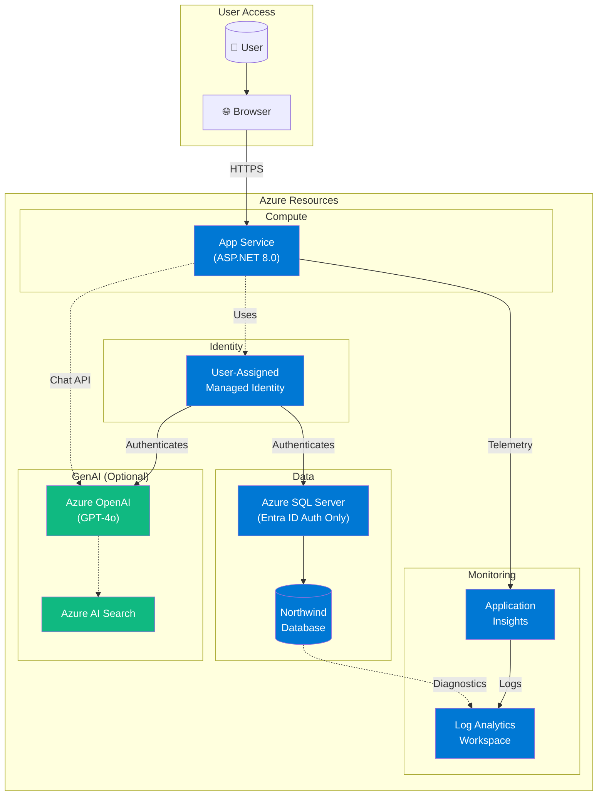
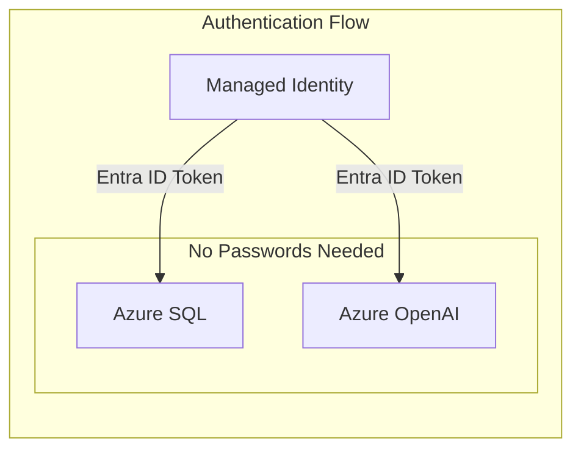
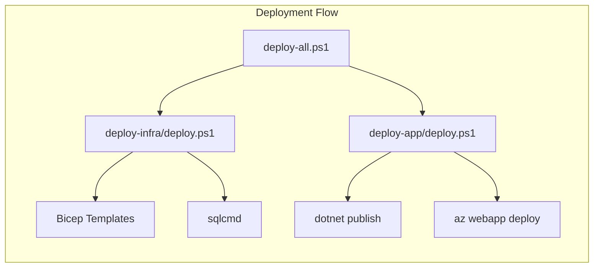

# Azure Architecture Diagram

This document describes the Azure services deployed by the Expense Management application.

## Architecture Overview

## Resource Details

### Core Resources

| Resource | Type | Purpose |
|----------|------|---------|
| App Service | Microsoft.Web/sites | Hosts the ASP.NET 8.0 web application |
| App Service Plan | Microsoft.Web/serverfarms | Standard S1 tier for hosting |
| SQL Server | Microsoft.Sql/servers | Azure SQL with Entra ID-only auth |
| SQL Database | Microsoft.Sql/servers/databases | 'Northwind' database (Basic tier) |
| Managed Identity | Microsoft.ManagedIdentity | Passwordless authentication |
| Log Analytics | Microsoft.OperationalInsights | Centralized log storage |
| Application Insights | Microsoft.Insights | APM and telemetry |

### Optional GenAI Resources

| Resource | Type | Purpose |
|----------|------|---------|
| Azure OpenAI | Microsoft.CognitiveServices/accounts | GPT-4o for chat functionality |
| AI Search | Microsoft.Search/searchServices | Semantic search (future use) |

## Security Model

- **No SQL passwords**: Uses Entra ID Managed Identity authentication
- **No API keys**: Azure OpenAI uses Managed Identity with RBAC
- **Secrets-free**: All authentication via Azure AD tokens

## Deployment Scripts

## Network Flow

1. User accesses the application via HTTPS
2. App Service runs the ASP.NET application
3. Application uses Managed Identity to authenticate to:
   - Azure SQL Database (for expense data)
   - Azure OpenAI (for chat functionality)
4. All telemetry flows to Application Insights
5. Logs are stored in Log Analytics Workspace
